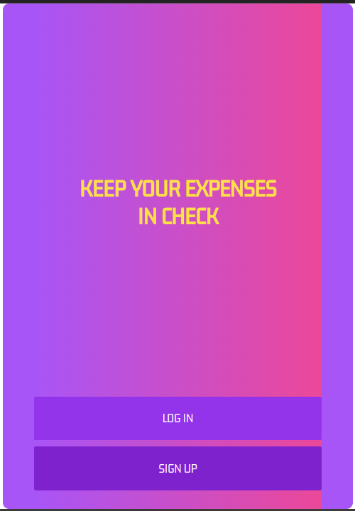
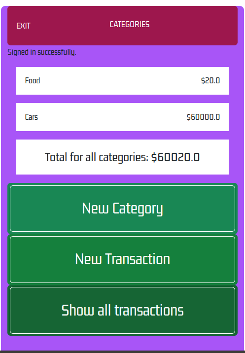
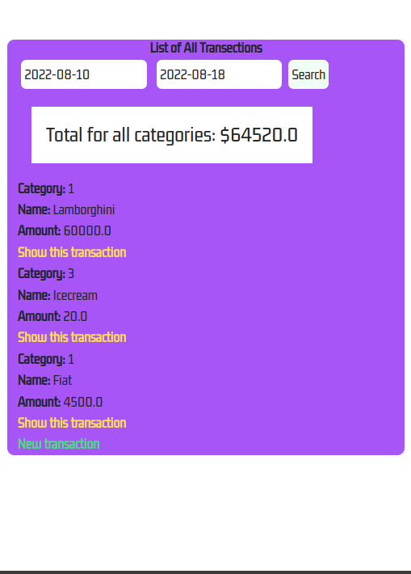
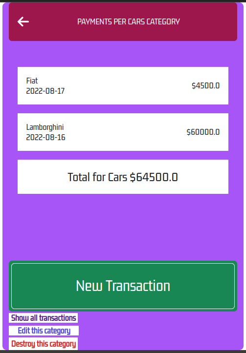

# Expenses Regulation

> This Ruby on Rails project is about building a mobile web application where user can manage his/her/their budget, having a list of transactions associated with a category, so that user can see how much money is spent and on what. 

Each user has the possibility to:

- get statistics of his/her/their expenses - for all categories at once or for one of them,
- delete any of his/her/their transactions,
- view statistics of his/her/their expenses for any period of time by entering the appropriate dates in the search box on the "All transactions" page.






## Live Demo

[Run if currently available](https://expenses-regulation.herokuapp.com/)

## Built With

- Major languages (Ruby)
- Framworks (Ruby on Rails)

## Getting Started

To get a local copy up and running follow these simple example steps.

## Prerequisites

- A text editor(preferably Visual Studio Code)

## Install

- Ruby
- Ruby on Rails
- PostgresSQL
- Rspec

## Using it Locally

- Clone the project

## Setup

Install gems with:

```
bundle install
```
Setup database with:

```
rails db:create
rails db:migrate
rails db:seed
```
## Usage

Start server with:

```
rails server
```
Open http://localhost:3000/ in your browser.

## Install linter

```bash
bundle install
```
## Run tests

Install rspec with:

```
bundle install
```
and
```
rails generate rspec:install
```
run the test with:
```
rails exec rspec
```
## Visit And Open Files

[Visit Repo](https://github.com/Gegardus/expenses-regulation)

## Clone Repo

[Clone Repo](https://github.com/Gegardus/expenses-regulation.git)

## Author

👤 **Vahan Khachvankian**

- GitHub: [@githubhandle](https://github.com/Gegardus)
- Twitter: [@twitterhandle](https://twitter.com/Gegardus)
- LinkedIn: [@linkedinhandle](https://www.linkedin.com/in/vahan-khachvankian)

## 🤝 Contributing

Contributions, issues, and feature requests are welcome!

Feel free to check the [issues page](https://github.com/Gegardus/expenses-regulation/issues).

## Show your support

Give a ⭐️ if you like this project!
